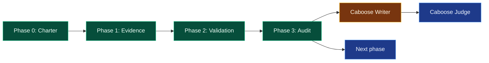

# Caboose Phase Documentation Pattern

Generated: 2026-05-17
Status: reusable operating pattern, v0

## Purpose

Caboose is a phase-end documentation and review pattern for Hermes/Kanban projects. It gives humans and agents a consistent checkpoint artifact with a dashboard-style status view, project scope, evidence ledger, blockers, and next gate.

It is designed for long-horizon work where context otherwise scatters across chat, Kanban cards, artifacts, screenshots, reports, and model memory.

## Core rule

Caboose is **not** a new workflow engine.

It must remain a thin documentation/review convention over native Hermes Kanban primitives:

- boards;
- normal cards;
- parent/child dependencies;
- comments;
- blocked/review-required states;
- run summaries and metadata;
- artifact paths and logs.

Do not create a separate state machine, dispatcher, database, or truth source unless a native Kanban gap is explicitly documented.

## When to use

Use Caboose when a project reaches a meaningful checkpoint:

- end of a research or engineering phase;
- before moving from evidence gathering to decision-making;
- before starting a new phase with different scope;
- when a human needs mental clarity on current state;
- when negative evidence or a blocked result needs to be preserved cleanly;
- when another agent/project should inherit the method.

Do not use it for every small errand.

## Required report structure

A substantial Caboose report should contain, in order:

1. Title / identity
2. Ten-second dashboard
3. Purpose
4. Background
5. Scope
6. Current status
7. Phase map
8. Evidence ledger
9. Decisions and recommendations
10. Open questions and blockers
11. Does-not-prove boundary
12. Next gate
13. Caboose Judge result

## Ten-second dashboard

The dashboard appears near the top and should answer quickly:

- What project is this?
- What phase are we in?
- What is complete?
- What is blocked?
- What is next?
- Has the report been judged?

Use a Mermaid diagram in Markdown and an inline SVG or equivalent in HTML.

### Mermaid template

## Status color semantics

| Status | Color | Meaning |
|---|---|---|
| Complete / accepted | Green | Evidence supports the narrow claim. |
| Partial / caution / writer-pass | Yellow | Useful but bounded; not final truth. |
| Blocked / rejected / failed | Red | Do not advance without new evidence or decision. |
| Pending / todo | Blue | Valid next work, not executed yet. |
| Archived / out-of-scope | Gray | Preserved for context, not active. |

## Caboose Writer

The Writer creates the report. It should be stateless and evidence-bound.

Inputs:

- board slug and workspace path;
- Kanban list/stats/show output;
- relevant plan, traceability report, audit, decision memo, run reports;
- screenshots or user review comments when they are part of the evidence.

Responsibilities:

1. Inspect native Kanban state.
2. Read artifacts directly rather than relying on chat memory.
3. Use the required report sections.
4. Put the phase/status diagram near the top.
5. Keep status colors honest.
6. Include exact evidence paths.
7. Include a does-not-prove boundary.
8. Mark Judge result as pending unless review actually happened.

## Caboose Judge

The Judge audits the report before it becomes the accepted phase checkpoint. The final judge may be a human; an independent agent can do a first-pass review.

Checklist:

- Required sections present.
- Dashboard gives current state in roughly ten seconds.
- Major claims have evidence paths or Kanban references.
- Color/status labels match the evidence.
- In-scope and out-of-scope are explicit.
- Does-not-prove boundary is present.
- Next gate and acceptance criteria are concrete.
- No custom Kanban fork or hidden truth source was invented.

Judge outcomes:

- `accepted`
- `accepted-with-notes`
- `changes-requested`
- `blocked`

## Example application: CAD/FEA evaluation

The CAD/FEA project used Caboose after first-pass package evaluation:

- first-pass package evaluation complete;
- no package adoption-ready;
- Package 4 / CAD Skills remains helper-only;
- G1 circular flange blocked as useful negative evidence because local numeric/topology validation passed while Creo section/design-intent review failed;
- G2 primitive suite remains todo and gated;
- next decisive proof is Benchmark A: CAD -> independent check -> mesh -> CalculiX -> result JSON -> geometry revision.

## Domain transfer

The same structure works for biology or other research projects. Replace CAD artifacts with domain evidence:

- papers, protocols, datasets, lab notes, or citations;
- ethical/safety/medical boundaries;
- hypothesis and experimental scope;
- unresolved uncertainties;
- next evidence gate.

The reusable principle is domain-neutral:

> Evidence first, dashboard near the top, scope boundaries explicit, judge before project truth.
