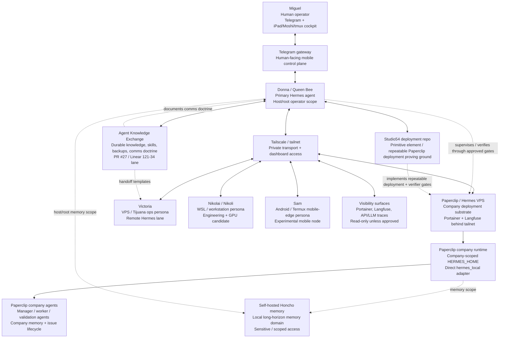

# Empire Current Structure Overview

## Purpose

Provide a high-level, redacted map of Miguel's current agent empire: where the main personas live, how the communication plane is intended to work over the tailnet, and why the current Studio54/Paperclip recovery work is focused on repeatable communications and memory-layer correctness.

This is a governance and orientation document. It is not an authorization to mutate infrastructure, expose secrets, restart services, or read raw runtime state.

## Scope

This document covers the main parts only:

- Donna / Queen Bee as Miguel's primary Hermes operator.
- The Telegram gateway as Miguel's mobile control surface.
- Tailscale / tailnet as the private network layer connecting machines and dashboards.
- Remote personas such as Victoria, Nikolai/Nikoli, and Sam.
- Paperclip company deployments using Hermes-backed company agents.
- The Studio54 deployment repo as the repeatable deployment/proving ground.
- The Agent Knowledge Exchange repo as the durable operating knowledge base and PR surface for communication-plane doctrine.

Out of scope unless separately approved:

- Secret values, `.env` contents, private keys, session databases, raw logs, memory dumps, or credentials.
- Live VPS mutation, service restarts, firewall edits, Docker changes, or Paperclip state changes.
- External messaging automation or account setup.

## Current high-level map

## Plane definitions

### Human control surface

Miguel primarily talks to Donna through Telegram. The iPad/Moshi/tmux path is a cockpit: it lets Miguel see or manually drive a remote persona session, but it is not considered a reliable agent-to-agent courier by itself.

### Private network plane

Tailscale is the private transport layer. It is useful for SSH, dashboard reachability, and private service exposure. Tailnet reachability does not automatically prove that an agent can be controlled, that a tmux session is healthy, or that Paperclip/Hermes memory is correct.

### Agent communication plane

Donna is the intended Queen Bee / CEO control plane. The desired communication behavior is:

1. Donna sends a bounded handoff directly to a target persona or company agent when a reliable lane exists.
2. The target acknowledges with `QACK`, reports with `QSTATUS`, finishes with `QDONE`, or escalates with `QBLOCKED`.
3. If direct contact fails, Donna immediately tells Miguel and emits a paste-ready relay message instead of silently waiting.
4. GitHub issues, PRs, Linear, and AKE docs become the durable ledger rather than relying on raw tmux panes or memory.

### Workload / deployment plane

Studio54 is the deployment and verification proving ground. The goal is to make the primitive element repeatable: a Paperclip company deployment where Hermes-backed agents can be created, assigned work, write/recall memory in the correct scope, and prove isolation between host/root and company scopes.

Paperclip owns company state. Inner Hermes runs should use company-scoped runtime homes, such as company-scoped `HERMES_HOME`, and should not implicitly share Donna's host/root memory.

### Observability plane

Portainer and Langfuse are visibility surfaces behind the tailnet. They are for controlled review of containers, traces, API calls, LLM calls, and operator status. Visibility is not mutation authority.

## Current structure by persona / node

### Donna

- Role: Queen Bee, primary operator, architecture owner, and coordination hub.
- Current surface: Telegram DM with Miguel plus local tools and repo access.
- Responsibilities:
  - produce high-level architecture and recovery plans,
  - keep issue/PR/knowledge docs aligned,
  - create bounded handoffs,
  - verify memory and communications gates before claiming success,
  - escalate promptly when direct lanes fail.

### Victoria

- Role: remote VPS / Tijuana operations persona.
- Current issue: communication/contact lane has not been fully reliable. Prior work touched Victoria communication starter/operating docs, but direct operational contact still needs a dependable courier contract and acknowledgment loop.
- Desired next behavior: Victoria receives bounded `QTASK` handoffs, acknowledges with `QACK`, works only within approved scope, and reports final artifacts with `QDONE` or blocker details with `QBLOCKED`.

### Nikolai / Nikoli

- Role: WSL/workstation engineering persona and possible GPU-capable worker.
- Current issue: Donna previously attempted to reach `ssh nikoli`, but the lane timed out against `nikoli-wsl` on port 22. Tailscale visibility alone did not prove SSH/tmux control.
- Desired next behavior: read-only readiness checks should distinguish tailnet presence, SSH reachability, tmux session health, Hermes profile readiness, and GitHub/working-tree scope before assigning real work.

### Sam

- Role: Android/Termux mobile-edge persona.
- Current status: useful but still experimental. SSH and mobile persistence need explicit readiness evidence before Sam is treated as a reliable production worker.
- Desired next behavior: keep Sam as a candidate node until transport, persistence, and safe execution contracts are documented and verified.

### Paperclip company agents

- Role: inner company workforce: manager, worker, validation agents.
- Current direction: use direct per-company `hermes_local` with company-scoped `HERMES_HOME` rather than gateway-first or per-agent local-memory isolation.
- Required proof: behavioral write/recall/isolation, not just file existence or service health.

## Recent issues and what we are doing about them

### 1. Communication between Donna and remote Hermes agents is not yet 100% reliable

Problem:

- Some routes are reachable at the network or dashboard level but fail as agent-control channels.
- tmux/iPad/Moshi paths are useful cockpit surfaces, but can mix Miguel's manual prompt buffer with Donna's intended courier lane.
- Without a structured acknowledgment loop, Donna can believe a handoff happened when the target never received or accepted it.

Current solution direction:

- Define the Queen Bee communication protocol: `QPING`, `QTASK`, `QACK`, `QSTATUS`, `QDONE`, `QBLOCKED`, and `QFAIL`.
- Treat GitHub/Linear/AKE/Paperclip issues as durable ledgers.
- Use paste-ready manual relay when direct contact fails.
- Avoid silent waiting: if the lane is blocked, Donna should say so immediately and hand Miguel a clean relay payload.

### 2. Victoria contact and iPad/tmux cockpit ambiguity

Problem:

- Victoria-related communication work exists, but the reliable Donna-to-Victoria courier lane is not the same thing as Miguel attaching to a tmux session from iPad/Moshi.
- The iPad/tmux path is valuable for manual operations, but it should not be the canonical proof of agent-to-agent delivery.

Current solution direction:

- Document cockpit vs courier semantics.
- Keep Victoria handoffs bounded and reviewable.
- Require explicit `QACK`/`QDONE` evidence or a clear `QBLOCKED` report.
- Use AKE PRs for communication-plane doctrine before wiring more automation.

### 3. Nikolai reachability failure

Problem:

- Donna attempted to contact Nikolai/Nikoli through SSH and hit a timeout against the WSL host route.
- This means tailnet/device presence was insufficient proof of an operable agent lane.

Current solution direction:

- Treat Nikolai as blocked for direct work until read-only readiness checks pass.
- Separate checks into tailnet, SSH, tmux, Hermes profile, repo access, and no-mutation boundaries.
- If Miguel can reach Nikolai manually, Donna should provide paste-ready relay messages instead of pretending the direct route works.

### 4. Donna/Miguel misalignment around Studio54 PR #27 and issue #25

Problem:

- Miguel expected the Studio54 deployment iteration to move the primitive element toward real repeatable deployment, communication-plane reliability, and memory-layer correctness.
- PR #27 in Studio54 was treated too much like a solution, but it was really a scaffold/simulation step. It did not prove the live VPS was left in the full intended memory-correct state.
- The misalignment was not just technical; it was a planning and evidence problem. The work needs to distinguish simulated CI scaffolds from real behavioral proof.

Current solution direction:

- Keep the Studio54 recovery focused on issue #25: actual layered memory correctness, behavioral sentinel write/recall, no-leakage checks, and deterministic structured reports.
- Continue from the proven Paperclip/VPS baseline and `company.txt` evidence instead of pretending a fresh fake deployment is enough.
- Capture the `company.txt` manual relay loop as the v0 communications protocol template.
- Put communication-plane doctrine and empire overview work in Agent Knowledge Exchange, not Studio54, because AKE is the durable knowledge base.
- Keep Studio54 for implementation: scripts, verifier gates, templates, and repeatable Paperclip company deployment proof.

## Repeatable deployment target

The desired primitive element is plug-and-play:

1. A node joins the tailnet and exposes approved dashboards privately.
2. Outer Hermes exists at host/root scope for operator work.
3. Paperclip deploys a company with `hermes_local` agents and company-scoped runtime homes.
4. Manager/worker agents can coordinate through Paperclip issues without runaway task spawning.
5. Memory checks prove:
   - host/root Hermes memory remains separate,
   - company A memory works,
   - company B memory works,
   - cross-company leakage does not occur,
   - behavioral recall succeeds after writes.
6. Communication checks prove:
   - direct agent lanes acknowledge work when available,
   - blocked lanes report failure clearly,
   - paste-ready relay fallback exists,
   - final artifacts are linked in GitHub/Linear/AKE/Paperclip as appropriate.

## Repository split

### Agent Knowledge Exchange

AKE holds durable doctrine and reusable knowledge:

- empire overview documents,
- communication-plane protocols,
- persona handoff templates,
- operating procedures,
- skills and recovery playbooks,
- redacted architecture notes.

This document belongs in AKE.

### Studio54

Studio54 holds the deployment implementation and proof gates:

- Paperclip/Hermes bootstrap scripts,
- templates such as one-agent and manager-worker company definitions,
- layered memory verifier scripts,
- communications readiness gates,
- CI checks and structured reports,
- live-VPS proof plans gated by explicit approval.

Studio54 should not be the place where broad empire doctrine gets buried.

## Immediate next steps

1. Land this overview in the AKE PR for Linear `121-34`.
2. Keep the communication-plane protocol in AKE and cross-reference it from Studio54 recovery docs.
3. In Studio54, implement actual issue #25 verifier gates for layered memory and communication readiness.
4. For Victoria/Nikolai/Sam, require read-only route readiness and `QACK`/`QDONE` evidence before treating them as reliable workers.
5. Keep Miguel in the loop with paste-ready relay payloads whenever Donna's direct lane is blocked.

## Safety statement

No secrets, raw logs, auth exports, private keys, `.env` values, session databases, or memory dumps should be added to this repo. This document intentionally describes structure, risks, and operating doctrine at a redacted architecture level only.
