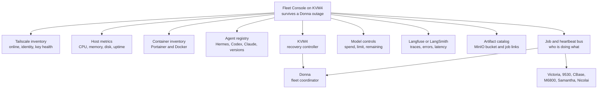

# Fleet Dashboard Blueprint

_Baseline recovered: 2026-07-15._

## Outcome

Build one operator view that keeps four different questions separate:

1. Is the device connected to Tailscale?
2. Can an authorized controller manage it?
3. Are its services and containers healthy?
4. What job is each agent doing, and what is it costing?

These states must not collapse into one green/red indicator. M6800, for
example, is online in Tailscale but currently refuses SSH.

## Proposed hierarchy



KVM4 is the preferred dashboard host because it must retain visibility during
a Donna outage. Donna remains the coordination and workload plane. KVM4 is
also the reference VPS deployment, excluding machine-specific secrets and
data.

## Dashboard levels

### Fleet overview

- Tailscale state and last seen
- management-path state
- active agents and current job summary
- running, healthy, and failed container counts
- CPU, memory, disk, and uptime
- model/API spend and allowance remaining
- alert count and highest severity

### Device detail

- hardware, operating system, and Tailscale identity
- installed agent versions and paths
- Compose projects, containers, health, logs, and controlled restarts
- Hermes gateway/dashboard health and recent jobs
- MinIO capacity, buckets, replication, and consumers
- recent deployments and configuration drift

### Job or trace detail

- coordinator, worker, job ID, parent job, and stage
- redacted prompt/tool/model metadata
- duration, token usage, cost, retries, and errors
- MinIO input/output artifacts
- Langfuse or LangSmith traces and related logs

## Trust identities versus labels

Tailscale tags are durable security identities. Flexible descriptions such as
`gpu`, `macos`, `local-llm`, `comfyui`, or a current job belong in dashboard
metadata and must not alter network access.

Do not tag Donna or KVM4 until tests prove 9530 retains administrative and
emergency recovery access. Applying a tag replaces user identity; it is not a
cosmetic label.

## Existing systems to reuse

- Inspect Donna's Portainer before deploying another instance.
- Determine whether Donna and KVM4 MinIO are independent, replicated, or
  accidental duplicates.
- Evaluate the existing Donna/KVM4 Langfuse deployments before adding another
  tracing platform.
- Reuse existing 1215 infrastructure such as n8n, Qdrant, ClickHouse, Neo4j,
  and ComfyUI where appropriate.

## Secret-free heartbeat contract

```json
{
  "node": "donna",
  "timestamp": "RFC3339 timestamp",
  "agent": "hermes",
  "agent_version": "version or null",
  "state": "idle|working|blocked|offline",
  "job_id": "opaque identifier or null",
  "containers_running": 0,
  "containers_unhealthy": 0,
  "cpu_percent": 0,
  "memory_percent": 0,
  "disk_percent": 0,
  "model_spend_usd": 0
}
```

Secrets, environment values, prompts, OAuth tokens, private keys, and API keys
must never be included.

## Preconditions

1. Restore management visibility into Victoria and M6800.
2. Capture fresh read-only Hostinger provider state.
3. Inspect existing Portainer, MinIO, and Langfuse coverage.
4. Implement a repeatable, secret-free inventory collector.
5. Only then design and test tag migration and live policy changes.
