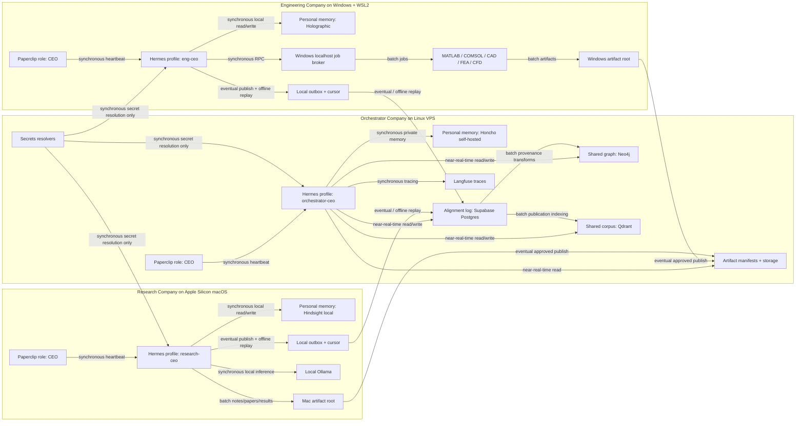

# Self-Hosted Long-Horizon Memory Architecture for Three Hermes-Backed Paperclip Companies

## Executive summary

**Confirmed facts.** Paperclip is designed as an orchestration layer for AI companies: it provides org charts, heartbeats, budgets, tickets, governance, multi-company isolation, and an embedded PostgreSQL option, while its public roadmap still lists “Memory / Knowledge” and “Automatic Organizational Learning” as not-yet-delivered roadmap items. Hermes Agent supports persistent built-in memory, profile isolation, session persistence, and one optional external memory provider at a time, with built-in memory always remaining active. The Hermes Paperclip adapter runs Hermes as a subprocess in quiet mode and, when `persistSession` is enabled, reuses a prior session with `--resume`; it also appends `extraArgs`, merges `env`, honors `cwd`, and unconditionally adds `--yolo` because the agent runs non-interactively. Supabase, Neo4j, Qdrant, Ollama, Langfuse, n8n, Flowise, and Caddy are already present in the stated VPS stack via `coleam00/local-ai-packaged`, so the brokered shared layer can be implemented without introducing a new core platform. 

**Primary architecture.** Use a **provider-insulated, shared-state-first architecture**. Keep **personal Hermes memory private and local to each company**, and make all inter-company continuity flow through a **VPS-brokered append-only alignment log in Postgres**, a **shared Neo4j fact graph**, a **shared Qdrant semantic corpus**, **artifact manifests and storage**, and **Langfuse traces**. For personal Hermes memory, use **Holographic on Engineering/WSL2**, **Hindsight local mode on Research/macOS**, and **Honcho self-hosted on the Orchestrator VPS**. This combination best matches the workloads: Holographic is the lightest no-dependency local store in Hermes; Hindsight has explicit official Hermes integration and local/offline operation; Honcho adds the strongest advertised reflection, conclusion synthesis, and peer/workspace separation for long-horizon orchestration work. 

**Fallback architecture.** Keep the same alignment log, graph, vector corpus, artifact manifests, secrets boundaries, and Paperclip adapter pattern, but demote personal providers to a **less ambitious shared-state-first mode**: **Hindsight local on Engineering if the WSL2 Holographic path proves fragile**, **OpenViking on Research if Hindsight local proves operationally brittle**, and **Hindsight backed by VPS Postgres for the Orchestrator if Honcho’s dialectic path proves too failure-prone or too costly to operate**. In the fallback, the shared publish/replay layer, not provider-native reasoning, becomes the authoritative long-horizon continuity surface. That preserves swap-out insulation and keeps the system working if any provider becomes unstable. 

**Top decisions that drove the recommendation.** The first decision is to keep **personal memory and shared organizational memory separate**, because Hermes supports profile-isolated local memory while Paperclip does not yet present itself as the durable knowledge plane. The second is to make **Postgres the canonical alignment-log substrate**, because it gives ordered replay, strong idempotency controls, and easier forensics than Neo4j, n8n, or provider-specific memory backends. The third is to choose **provider by workload**, not by aesthetic consistency: WSL2 favors dependency-light local state; the Mac research node benefits from a richer self-hosted memory engine; the VPS Orchestrator benefits from synthesis-oriented memory with explicit reasoning controls. 

**Top risks.** The largest technical risk is **provider/runtime instability at the Hermes integration seam**, because Hermes’s recent releases significantly expanded and changed profile and memory-provider behavior, while open issues still exist around profile home isolation and duplicate local-provider instances against the same SQLite-backed store. The second risk is **Paperclip execution-lock hygiene**: current Paperclip issues show stale execution locks after failed, cancelled, or killed runs, which is especially relevant for long-lived heartbeat-driven companies. The third risk is **secret leakage through prompts, memory, or traces**, made more important by the adapter’s `--yolo` behavior and by the possibility of using cloud frontier models for Engineering and Orchestrator. 

**First prototype to run.** Run a **single-machine Phase 0 Mac smoke test** before any multi-company setup: built-in Hermes memory only, then Hindsight local, then Holographic, all against the same restart-and-resume script. Measure session resumability across 10 forced restarts, durable fact recall after reboot, first-start latency, asynchronous retention lag, corruption behavior after unclean exit, and whether any seed secrets or faux secrets leak into memory files or logs. This is the cheapest way to resolve the most load-bearing uncertainties before committing to Paperclip orchestration. 

**Reasoned recommendations.** The architecture below treats the alignment log and shared stores as the durable inter-company contract, and treats personal providers as swappable per-role cognition layers. That is the most practical way to get long-horizon continuity, role isolation, and future provider swaps without blocking implementation. 

**Unverified assumptions.** The brief specifies “Hermes-backed CEOs,” the three host roles, the VPS stack, and the cross-company isolation rules. It does **not** specify a mandatory embedding model for Qdrant, a mandatory Windows broker framework, or a mandatory secrets manager product. Those remain design choices.

**Required prototypes.** Even the recommended providers still require Phase 0 and Phase 1 empirical checks for restart safety, file placement, response latency, upgrade behavior, and prompt/redaction hygiene, especially on WSL2 and in Honcho’s dialectic path.

## Evidence base

### Evidence ledger

| Claim | Source | Grade | Confidence | Implementation implication | Prototype needed |
|---|---|---:|---:|---|---|
| Paperclip supports one deployment with many companies and complete data isolation. | Paperclip README / FAQ  | A | High | One VPS deployment can host all three companies while preserving Paperclip-side tenancy. | No |
| Paperclip’s roadmap still lists “Memory / Knowledge” and “Automatic Organizational Learning” as future work. | Paperclip roadmap / README  | A | High | Durable memory should live in Hermes plus external stores, not in Paperclip itself. | No |
| Hermes profiles are intended as fully isolated environments with separate config, `.env`, memory, sessions, skills, cron, and state DB. | Hermes profiles docs  | A | High | Use one explicit Hermes profile per CEO and any memory-bearing subordinate. | No |
| Hermes allows only one external memory provider at a time; built-in memory remains active. | Hermes CLI / memory-provider docs  | A | High | Provider choice must stay orthogonal to shared-state design; no multi-provider chaining inside one profile. | No |
| Holographic is a local SQLite fact store with FTS5, trust scoring, and no external dependencies. | Hermes provider docs  | A | High | Best low-ops primary choice for WSL2 Engineering. | Yes, WSL2 soak |
| Hindsight has official Hermes integration, local mode, explicit Linux/macOS/Windows support, and embedded pg0 that is convenient for development but not recommended for production. | Hindsight integration/config/install docs  | A | High | Strong primary choice for Research; use local mode first, but keep an upgrade path to external Postgres. | Yes |
| Hindsight local mode has first-start latency and asynchronous retention behavior. | Hindsight migration/debug docs  | B | Medium-High | Admission gate must measure retain→recall lag and restart behavior before commitment. | Yes |
| Honcho self-hosting requires PostgreSQL with pgvector and an LLM provider; any OpenAI-compatible endpoint can work, including Ollama-style local endpoints if they support tool calling. | Honcho self-hosting docs  | A | High | Strong primary choice for Orchestrator, with local LLM routing for cost control. | Yes |
| Honcho adds dialectic reasoning, conclusions, semantic search over conclusions, and multi-peer separation on top of built-in Hermes memory. | Hermes Honcho docs / Honcho Hermes guide  | A | High | Best fit for Orchestrator-level synthesis and cross-session steering. | Yes |
| OpenViking is an official Hermes provider, ships precompiled wheels across Windows/macOS/Linux, but its Hermes provider currently uses only a subset of the available API surface. | Hermes CLI / OpenViking docs / Hermes issue  | B | Medium | Good fallback for Research, but not the best primary until the integration surface matures. | Yes |
| ByteRover is explicitly local-first, stores local knowledge in `.brv/context-tree`, works headlessly, and documents WSL 2 guidance to keep project files in the WSL filesystem. | ByteRover docs and releases  | B | High | Useful as a coding-memory adjunct and a good evidence source for WSL file placement discipline. | Yes |
| The Hermes Paperclip adapter maps `persistSession`, `worktreeMode`, `checkpoints`, `extraArgs`, `env`, and `cwd` directly into Hermes subprocess behavior, and adds `--yolo`. | Adapter README and `execute.ts`  | A | High | Company isolation must be enforced explicitly via profile, env, and working directory. | Yes |
| The adapter currently has no published releases and active April 2026 issues. | Adapter releases/issues pages  | B | Medium | Pin adapter commits/versions; treat it as infrastructure, not a floating dependency. | Yes |
| Paperclip currently has active stale-lock issues after failed, killed, or cancelled runs. | Paperclip issues  | B | High | Hardening must include lock-audit and manual lock-clear runbooks. | Yes |

### Provider verification ledger

The table below follows the requested verification pass. “Current source location” is shown as the primary source used in this pass, not an exhaustive source list.

| Provider | Current source location | Last meaningful update or release | Install model and runtime deps | Storage backend | Hermes compatibility evidence | WSL2 evidence | macOS evidence | Linux VPS evidence | Known risks | Grade |
|---|---|---|---|---|---|---|---|---|---|---:|
| Hindsight local mode | Hindsight Hermes integration and install/config docs  | `v0.5.3` on Apr 17, 2026  | `pip install hindsight-all`; local daemon/server; LLM provider required unless using chunk-only mode; model downloads on first run for embeddings/rerankers  | Embedded `pg0` by default or external Postgres schema; docs recommend external Postgres for production  | Official Hermes integration page and hook/tool model  | No official Hindsight page says “WSL2” explicitly; Windows is officially supported, so WSL2 is **plausible but indirect**. | Explicitly supported on Apple Silicon and Intel macOS  | Explicitly supported on Linux x86_64/ARM64  | First-start delay, asynchronous retain/recall timing, embedded DB not ideal for production, extra model downloads on first run  | A for Hermes/macOS/Linux; B for WSL2 |
| Holographic | Hermes memory-provider docs  | Current in Hermes v0.10.0 / v0.9.0 era provider system  | Built into Hermes provider system; SQLite always present; NumPy optional  | Local SQLite database at `$HERMES_HOME/memory_store.db` by default  | Official Hermes provider docs  | Indirect only: Hermes docs support WSL2 generally, but Holographic-on-WSL2 requires empirical validation. | Indirect but strong: Hermes runs on macOS and Holographic uses only local SQLite. | Indirect but strong: Hermes runs on Linux and Holographic uses only local SQLite. | Open issue about a second provider instance against the same SQLite DB during background review; recent profile-home changes also affected path behavior  | B |
| Mnemosyne community plugin | No official Hermes provider source located in primary Hermes docs; not listed in current Hermes provider list  | Unspecified in primary-source pass | Unspecified in primary-source pass | Unspecified in primary-source pass | No official Hermes compatibility evidence found in current Hermes docs  | Unspecified | Unspecified | Unspecified | High ambiguity, no trustworthy primary-source integration proof in this pass | F |
| OpenViking self-hosted | Hermes provider list, PyPI, OpenViking repo/release pages  | OpenViking `v0.3.8`; release notes indexed in Apr 2026  | `pip install openviking`; Python 3.10+, Go 1.22+, C++ compiler; source builds may require Rust/CMake too  | Official docs emphasize a filesystem-style context database; current issues show local vectordb/LanceDB/RocksDB behavior in some deployments, so backend details are partially configuration-dependent  | Official Hermes provider listing; active Hermes-side integration issue shows real provider exists but is incomplete  | No direct WSL2 claim found; Windows issues suggest caution around filesystems and locks. | Official precompiled wheel support includes Apple Silicon and Intel macOS  | Official support includes Linux x86_64/ARM64  | Windows lock/path issues, Hermes plugin only uses part of API surface, setup complexity higher than Hindsight/Holographic  | B overall, C on exact backend details |
| ByteRover local | Hermes provider list plus ByteRover docs/repo/releases  | `v3.7.0` on Apr 18, 2026  | Native installer or CLI; daemon-first headless operation; multiple providers; encrypted local credential files  | `.brv/context-tree/` local structured knowledge tree, with optional remote sync path to ByteRover cloud space  | Hermes lists ByteRover as an external provider  | Explicit WSL 2 guidance and recommendation to keep files inside the WSL filesystem  | Native support on Apple Silicon and Intel Mac via release/install docs  | Linux x64/ARM64 supported via native builds and docs  | Strongly coding-centric; breaking config changes documented in changelog; cloud-sync assumptions are not ideal for strictly self-hosted company memory  | B |
| Honcho self-hosted | Honcho self-host docs, Hermes integration guide, Hermes Honcho docs  | Docs version `v3.0.5`; active issue flow in Apr 2026  | Self-hosted server with PostgreSQL + pgvector; LLM provider mandatory; OpenAI-compatible endpoints supported  | Server-side Postgres + pgvector with API-based memory access  | Official Hermes integration guide and Hermes Honcho docs  | No explicit WSL2 operational guide found in this pass; treat as Linux-like but unverified. | Indirectly strong via local self-host path and Hermes integration; no macOS-specific caveat found in docs. | Strongest official self-host evidence here; VPS is a natural fit. | Active issues around embeddings, duplicates, custom-provider errors, and local model startup problems  | B |

### Provider recommendation matrix

Scores are **operator scores**, not vendor benchmarks. They synthesize the verified evidence above.

**Engineering CEO on WSL2**

| Provider | Hermes compatibility | Install simplicity | Resume robustness | Backup/restore | Reflection/synthesis | Local-first suitability | Operational maturity | Swap-out cost | Workload fit | Recommendation |
|---|---:|---:|---:|---:|---:|---:|---:|---:|---:|---|
| Holographic | 5 | 5 | 3 | 5 | 2 | 5 | 3 | 5 | 4 | **Primary** |
| Hindsight local | 5 | 3 | 4 | 3 | 4 | 4 | 4 | 4 | 4 | Fallback |
| OpenViking | 4 | 2 | 4 | 4 | 3 | 4 | 4 | 3 | 3 | Prototype only |
| ByteRover | 4 | 4 | 3 | 5 | 2 | 5 | 4 | 4 | 3 | Adjunct only |
| Honcho | 5 | 1 | 4 | 4 | 5 | 3 | 4 | 3 | 2 | Avoid on WSL2 |
| Mnemosyne | 1 | 1 | 1 | 2 | 2 | 2 | 1 | 1 | 1 | Avoid |

**Research CEO on Apple Silicon macOS**

| Provider | Hermes compatibility | Install simplicity | Resume robustness | Backup/restore | Reflection/synthesis | Local-first suitability | Operational maturity | Swap-out cost | Workload fit | Recommendation |
|---|---:|---:|---:|---:|---:|---:|---:|---:|---:|---|
| Hindsight local | 5 | 4 | 4 | 3 | 4 | 5 | 4 | 4 | 5 | **Primary** |
| OpenViking | 4 | 2 | 4 | 4 | 3 | 4 | 4 | 3 | 4 | **Fallback** |
| Holographic | 5 | 5 | 3 | 5 | 2 | 5 | 3 | 5 | 3 | Contingency fallback |
| ByteRover | 4 | 4 | 3 | 5 | 2 | 5 | 4 | 4 | 2 | Avoid as sole CEO provider |
| Honcho | 5 | 2 | 4 | 4 | 5 | 3 | 4 | 3 | 3 | Prototype only |
| Mnemosyne | 1 | 1 | 1 | 2 | 2 | 2 | 1 | 1 | 1 | Avoid |

**Orchestrator CEO on Linux VPS**

| Provider | Hermes compatibility | Install simplicity | Resume robustness | Backup/restore | Reflection/synthesis | Local-first suitability | Operational maturity | Swap-out cost | Workload fit | Recommendation |
|---|---:|---:|---:|---:|---:|---:|---:|---:|---:|---|
| Honcho | 5 | 2 | 4 | 4 | 5 | 4 | 4 | 3 | 5 | **Primary** |
| Hindsight external/local-server | 5 | 3 | 4 | 4 | 4 | 4 | 4 | 4 | 4 | **Fallback** |
| Holographic | 5 | 5 | 3 | 5 | 2 | 5 | 3 | 5 | 2 | Shared-state-only contingency |
| OpenViking | 4 | 2 | 4 | 4 | 3 | 4 | 4 | 3 | 3 | Prototype only |
| ByteRover | 4 | 4 | 3 | 5 | 2 | 5 | 4 | 4 | 1 | Avoid |
| Mnemosyne | 1 | 1 | 1 | 2 | 2 | 2 | 1 | 1 | 1 | Avoid |

These scores are driven by the verified provider properties above: Holographic’s simplicity and local SQLite profile make it the best fit for WSL2; Hindsight’s official Hermes integration and explicit local self-host mode make it the best fit for 24/7 literature and hypothesis work on the Mac; Honcho’s conclusions, context injection, workspace/peer separation, and dialectic controls make it the best fit for the Orchestrator role on the VPS. OpenViking is promising, but current Hermes integration evidence suggests a narrower-than-ideal provider surface today. ByteRover is strong for coding-agent memory, but it is too coding-centric and too remote-sync-oriented to be the sole CEO memory substrate in this design. 

## Architecture

### Primary architecture

**Confirmed facts.** Paperclip’s own execution model is company/role orchestration, not personal memory. Hermes profiles are explicitly isolated, and the adapter already exposes the knobs needed to force profile, workspace, and environment separation. The current VPS stack already contains the exact shared services needed for an append-only broker, a graph store, a vector store, and observability. 

**Reasoned recommendation.** Build **three independent Hermes profile domains**:

- Engineering Company CEO on WSL2: `eng-ceo` profile, **Holographic** provider, local-only private memory.
- Research Company CEO on macOS: `research-ceo` profile, **Hindsight local mode** provider, local 24/7 autoresearch memory.
- Orchestrator Company CEO on VPS: `orchestrator-ceo` profile, **Honcho self-hosted** provider, private synthesis memory independent of the two workstation hosts.

Keep **all cross-company visibility explicitly published** through these shared-state surfaces:
- **alignment log** in Supabase Postgres,
- **shared Neo4j** for structured facts,
- **shared Qdrant** for searchable published text,
- **artifact manifests and optionally replicated artifacts** on the VPS,
- **Langfuse** for execution provenance.

Engineering and Research remain mutually invisible at the **personal-memory** level. The Orchestrator reads only the published log, shared graph/corpus, authorized traces, and approved artifacts. That is the key isolation property of the system. It matches the current product boundaries and keeps provider choice orthogonal to inter-company continuity. 

**Unverified assumptions.** The brief does not specify a mandatory secrets-manager product, mandatory artifact replication tool, or mandatory embedding model for the shared Qdrant layer. Those are intentionally treated as implementation choices below.

**Required prototypes.** Before commitment, run:
- a **WSL2 Holographic soak** with 10 restart cycles,
- a **Mac Hindsight local soak** for 7 days of retain/recall/restart,
- a **VPS Honcho self-host bake-off** comparing local-Ollama-backed dialectic versus “dialectic disabled” mode,
- an **adapter isolation test** proving that `--profile`, `cwd`, and `HERMES_HOME` prevent cross-company bleed. 

### Fallback architecture

**Confirmed facts.** The shared-state layer is independent of any one external Hermes provider. Hermes can always fall back to built-in memory, and the provider interface allows turning the external provider off without changing the surrounding Paperclip or broker design. 

**Reasoned recommendation.** The fallback architecture keeps the same Paperclip companies, the same alignment log, the same Neo4j/Qdrant stores, and the same artifact and tracing interfaces, but reduces dependence on provider-specific cognition:

- Engineering CEO falls back from Holographic to **Hindsight local** if Holographic proves unstable on WSL2.
- Research CEO falls back from Hindsight local to **OpenViking** if Hindsight local proves too brittle or too slow under continuous autoresearch.
- Orchestrator CEO falls back from Honcho to **Hindsight on dedicated VPS Postgres** if Honcho’s dialectic layer is operationally too troublesome.
- If more than one provider path proves unreliable, the whole system can degrade one step further to **Hermes built-in memory plus shared-state-first operation**, with the alignment log, graph, corpus, and artifacts serving as the durable long-horizon substrate.

This fallback is deliberately conservative. It preserves every inter-company contract and every shared schema, which means provider failure does not force architecture failure. 

### Reference architecture diagram



**Latency classes.**  
Synchronous: heartbeat execution, local provider read/write, secret resolution, Windows broker RPC.  
Near-real-time: Orchestrator reads alignment log, Neo4j, Qdrant, Langfuse.  
Eventual: workstation publication to VPS, artifact publication, graph/corpus enrichment.  
Batch: summarization, artifact indexing, graph maintenance.  
Offline replay: outbox drain after host or VPS downtime.  

This diagram follows directly from the verified Paperclip, Hermes, adapter, and VPS-stack capabilities above. 

### Alignment-log design

**Confirmed facts.** The VPS already includes self-hosted Supabase/Postgres, and Paperclip itself uses PostgreSQL as its core transactional plane. Postgres is therefore already operationally present and familiar within the stack. 

**Substrate comparison**

| Candidate substrate | Fit | Why |
|---|---|---|
| Supabase Postgres table with thin Hermes skills | **Primary** | Best for append-only semantics, idempotency, replay, ordering, retention, SQL auditing, and provider independence. |
| n8n workflow | Fallback ingress | Useful as a transport wrapper or auth/retry façade, but weak as the canonical log. |
| Neo4j event subgraph | Derived view only | Good for evidence paths, poor as the sole ordered replay rail. |
| Honcho conclusions | Not recommended as substrate | Couples company-to-company communication to one personal provider and weakens provider-swap insulation. |

That recommendation follows from the existing VPS services and from the need for append-only replay, ordered cursors, and postmortem visibility. 

**SQL schema**

```sql
create table broadcast_entry (
  log_seq               bigint generated always as identity primary key,
  entry_id              uuid not null unique,
  idempotency_key       text not null,
  source_company_id     text not null,
  source_role           text not null,
  source_agent_id       text not null,
  source_profile        text not null,
  source_session_id     text,
  entry_kind            text not null check (
                         entry_kind in (
                           'status_update','research_finding','simulation_result',
                           'hypothesis_update','decision_note','question',
                           'blocker','steering_note','artifact_manifest'
                         )),
  visibility            text not null check (
                         visibility in (
                           'orchestrator_only','target_company_only','shared_publication'
                         )),
  target_company_id     text,
  created_at_client     timestamptz not null,
  received_at           timestamptz not null default now(),
  payload               jsonb not null,
  provenance            jsonb not null default '{}'::jsonb,
  artifact_refs         jsonb not null default '[]'::jsonb,
  body_sha256           text not null,
  supersedes_entry_id   uuid,
  secret_scan_status    text not null default 'clean'
                         check (secret_scan_status in ('clean','blocked','redacted')),
  unique (source_company_id, idempotency_key)
);

create index idx_broadcast_entry_received
  on broadcast_entry (received_at, log_seq);

create index idx_broadcast_entry_visibility
  on broadcast_entry (visibility, target_company_id, log_seq);

create index idx_broadcast_entry_source
  on broadcast_entry (source_company_id, source_role, log_seq);

create table broadcast_consumer_offset (
  consumer_id           text not null,
  stream_name           text not null default 'default',
  last_log_seq          bigint not null default 0,
  updated_at            timestamptz not null default now(),
  primary key (consumer_id, stream_name)
);

create table broadcast_ack (
  consumer_id           text not null,
  entry_id              uuid not null references broadcast_entry(entry_id),
  acked_at              timestamptz not null default now(),
  status                text not null default 'read'
                         check (status in ('read','processed','failed')),
  note                  text,
  primary key (consumer_id, entry_id)
);
```

**Append-only semantics.** `broadcast_entry` is never updated or deleted. Corrections are new rows linked by `supersedes_entry_id`. Consumer state lives separately in `broadcast_consumer_offset` and `broadcast_ack`. That keeps the publication rail forensic, replayable, and provider-agnostic.

**Idempotency strategy.** Use a deterministic key:
`sha256(source_company_id | source_role | source_profile | source_session_id | local_turn_ordinal | entry_kind | normalized_payload_hash)`

If a duplicate arrives with the same `body_sha256`, return the existing row as a duplicate success. If the same idempotency key arrives with a different hash, reject it as `409 idempotency_conflict`.

**Ordering guarantees.** Global replay order is `log_seq`, not client time. `created_at_client` is retained only for interpretation and debugging. This respects the brief’s eventual-consistency tolerance.

**Conflict handling.** Semantic contradiction is not solved inside the alignment log. The log records; the graph later models `SUPPORTS`, `CONTRADICTS`, and `SUPERSEDES`.

**Offline-write handling.** Each company keeps a durable local outbox:
- WSL2: `~/.hermes/outbox/broadcast.jsonl`
- macOS: `~/.hermes/outbox/broadcast.jsonl`
- VPS: same pattern for consistency

`broadcast_publish` must write to the outbox and fsync **before** attempting network publication. If the VPS is down, the entry remains in the outbox until replay succeeds.

**Replay behavior.** `broadcast_replay(cursor)` returns all rows with `log_seq > cursor`, filtered by authorization:
- Engineering reads its own entries and any targeted-to-Engineering steering.
- Research reads its own entries and any targeted-to-Research steering.
- Orchestrator reads all published entries, but never private Hermes memory, because only explicitly published material reaches this log.

**Retention policy.** Keep `broadcast_entry` hot and queryable for at least year one; partition monthly only after scale requires it. Keep `broadcast_ack` hot for 180 days, then archive if necessary. The alignment log is the highest-value forensic timeline in the system, so retention should be conservative.

These semantics are not externally mandated by a source; they are the recommended implementation because they best exploit the already-running Supabase/Postgres substrate and preserve provider independence. 

**Skill signatures**

```text
broadcast_publish(entry) -> { entry_id, log_seq, status }
broadcast_read_feed(filters) -> { entries, next_cursor }
broadcast_ack(entry_id, status="processed", note=null) -> { ok: true }
broadcast_replay(cursor, filters=null) -> { entries, next_cursor }
```

**Example entries**

```json
{
  "entry_kind": "simulation_result",
  "visibility": "orchestrator_only",
  "created_at_client": "2026-04-18T16:11:00Z",
  "source_session_id": "sess_abc123",
  "payload": {
    "title": "Sweep over blade angle converged",
    "summary": "Angle 17.5 deg minimized loss within tested range.",
    "confidence": "medium",
    "project_id": "prj_turbopump_a",
    "hypothesis_id": "hyp_blade_angle_loss",
    "decision_needed": false
  },
  "provenance": {
    "artifact_ids": ["art_01J..."],
    "tool": "comsol",
    "prompt_hash": "sha256:...",
    "input_manifest_hash": "sha256:..."
  }
}
```

```json
{
  "entry_kind": "research_finding",
  "visibility": "orchestrator_only",
  "payload": {
    "title": "Several papers imply lower cavitation onset threshold",
    "summary": "Recent literature cluster suggests a lower threshold than the prior working assumption.",
    "paper_ids": ["paper_a", "paper_b", "paper_c"],
    "confidence": "medium",
    "action": "validate in next simulation batch"
  }
}
```

**Error handling contract**
- `400` malformed payload
- `403` unauthorized target/visibility
- `409` idempotency conflict
- `422` blocked by secret scan
- `503` broker unavailable; caller retains outbox row for later replay

### Shared Neo4j and Qdrant design

**Confirmed facts.** The stated VPS stack includes both Neo4j and Qdrant. Hermes also has its own personal memory and session-search systems, which means the shared graph/corpus should be modeled as **orthogonal** shared-state surfaces, not as a replacement for private provider memory. 

**Reasoned recommendation.** Use Neo4j for **cross-company structured facts and evidence paths**, and Qdrant for **cross-company searchable published text**. The graph and corpus must be written only through publish/transform skills, never directly from personal provider state. That is what keeps provider swaps cheap and keeps company-private cognition private.

**Neo4j node labels and required properties**

| Label | Required properties |
|---|---|
| `Project` | `id`, `name`, `company_scope`, `status`, `created_at` |
| `Hypothesis` | `id`, `statement`, `status`, `confidence`, `created_at` |
| `Simulation` | `id`, `name`, `tool`, `run_status`, `created_at`, `artifact_id` |
| `Parameter` | `id`, `name`, `value`, `unit`, `sweep_group` |
| `Result` | `id`, `metric`, `value`, `unit`, `confidence`, `created_at` |
| `Paper` | `id`, `title`, `year`, `doi_or_uri`, `ingested_at` |
| `Decision` | `id`, `title`, `status`, `approved_by`, `created_at` |
| `Person` | `id`, `role_name`, `company_scope` |
| `Tool` | `id`, `name`, `version`, `host_scope` |
| `Artifact` | `id`, `uri`, `sha256`, `mime_type`, `size_bytes` |
| `Question` | `id`, `text`, `status`, `created_at` |
| `Blocker` | `id`, `title`, `severity`, `status`, `created_at` |

Every node should also carry provenance fields:
`provenance_source`, `provenance_entry_id`, `visibility`, `company_scope`, `updated_at`.

**Relationship types**
- `(:Project)-[:HAS_HYPOTHESIS]->(:Hypothesis)`
- `(:Hypothesis)-[:TESTED_BY]->(:Simulation)`
- `(:Simulation)-[:USES_PARAMETER]->(:Parameter)`
- `(:Simulation)-[:PRODUCED]->(:Result)`
- `(:Result)-[:SUPPORTS]->(:Hypothesis)`
- `(:Result)-[:CONTRADICTS]->(:Hypothesis)`
- `(:Paper)-[:INFORMS]->(:Hypothesis)`
- `(:Decision)-[:BASED_ON]->(:Result)`
- `(:Decision)-[:CITES]->(:Paper)`
- `(:Decision)-[:TARGETS]->(:Project)`
- `(:Artifact)-[:EVIDENCE_FOR]->(:Result)`
- `(:Tool)-[:RAN]->(:Simulation)`
- `(:Question)-[:ABOUT]->(:Project)`
- `(:Project)-[:BLOCKED_BY]->(:Blocker)`
- `(:Person)-[:OWNS]->(:Project)`

**Cypher write example**

```cypher
MERGE (p:Project {id: $project.id})
SET p.name = $project.name,
    p.company_scope = $project.company_scope,
    p.status = $project.status,
    p.updated_at = datetime()

MERGE (h:Hypothesis {id: $hypothesis.id})
SET h.statement = $hypothesis.statement,
    h.status = $hypothesis.status,
    h.confidence = $hypothesis.confidence,
    h.updated_at = datetime()

MERGE (p)-[r:HAS_HYPOTHESIS]->(h)
SET r.provenance_entry_id = $provenance.entry_id,
    r.updated_at = datetime();
```

**Cypher read example**

```cypher
MATCH (p:Project {id: $project_id})-[:HAS_HYPOTHESIS]->(h:Hypothesis)
OPTIONAL MATCH (h)<-[s:SUPPORTS|CONTRADICTS]-(r:Result)
RETURN h.id, h.statement, h.status, h.confidence,
       collect({
         result_id: r.id,
         metric: r.metric,
         value: r.value,
         relation: type(s)
       }) AS evidence;
```

**Qdrant collections**

| Collection | Purpose | Write source |
|---|---|---|
| `corpus_publications_v1` | Papers, decision memos, research summaries, design notes | Explicit publications only |
| `corpus_artifact_summaries_v1` | Simulation-result summaries and artifact manifests | Artifact summarizers |
| `corpus_alignment_v1` | Alignment-log entries and rollups | Broadcast transforms |

**Embedding strategy**

The brief leaves the shared embedding model unspecified. The practical recommendation is:
- Use **one self-hosted embedding model per collection generation**.
- Stamp `embedding_model`, `embedding_dim`, and `embed_timestamp` in metadata.
- If you want an immediate low-friction default, start with the same small local embedding family Hindsight already documents as its default semantic-search baseline, namely `BAAI/bge-small-en-v1.5`, and move to a new collection version if you later change models. That keeps storage, migration, and Qdrant rebuilds straightforward. 

**Chunking strategy**
- Papers and long notes: 800–1,200 tokens, 120-token overlap
- Decision memos: semantic sections, not fixed windows
- Artifact summaries: 300–700 tokens, minimal overlap
- Alignment entries: one entry per chunk unless the payload is unusually long

**Metadata schema**

```json
{
  "doc_id": "doc_...",
  "chunk_id": "doc_...#0003",
  "company_scope": "shared_publication",
  "source_type": "paper|artifact_summary|alignment_entry|decision_memo",
  "source_uri": "file://... or storage://...",
  "artifact_id": "art_...",
  "entry_id": "uuid",
  "title": "string",
  "created_at": "timestamp",
  "ingested_at": "timestamp",
  "embedding_model": "string",
  "sha256": "hex",
  "sensitivity": "public|restricted|blocked",
  "provenance": {
    "published_by_company": "research",
    "published_by_role": "CEO",
    "approval_id": "optional"
  }
}
```

**Qdrant point example**

```json
{
  "id": "doc_123#0001",
  "vector": [/* embedding */],
  "payload": {
    "doc_id": "doc_123",
    "chunk_id": "doc_123#0001",
    "source_type": "artifact_summary",
    "artifact_id": "art_123",
    "entry_id": "3d95f2a8-...",
    "company_scope": "shared_publication",
    "sha256": "4f0c...",
    "embedding_model": "BAAI/bge-small-en-v1.5",
    "created_at": "2026-04-18T17:02:00Z",
    "sensitivity": "public"
  }
}
```

**Write policy.** Only **explicitly published, non-secret, provenance-bearing** content enters the shared layer.

**Read policy.** Engineering and Research read only authorized shared scopes; Orchestrator reads all shared scopes; no company ever reads another company’s private Hermes memory.

**Deduplication policy.**  
Qdrant dedup key: `(sha256, source_type, company_scope)`  
Neo4j upsert key: stable semantic IDs, not raw text.

**Source provenance policy.** Every graph entity, graph edge, vector chunk, and artifact manifest must preserve:
- source URI
- alignment `entry_id`
- artifact ID if present
- publisher company and role
- publish time
- approval state

**Artifact handling policy.** Large binary outputs are never stored raw in personal provider memory and never embedded directly into Qdrant. Instead:
1. store the binary on the producing host,
2. generate a manifest and text summary,
3. register the artifact,
4. optionally replicate the artifact to VPS storage only when needed for cross-host access.

**Skills**

```text
kg_query(query, filters)
kg_write(nodes, relationships, provenance)
kg_upsert(entity)
corpus_add(document, metadata)
corpus_search(query, filters, top_k)
artifact_register(path_or_uri, metadata)
artifact_retrieve(artifact_id)
```

### Orchestrator memory design

**Confirmed facts.** Honcho’s Hermes integration and Hermes’s Honcho docs describe it as a memory backend that adds dialectic reasoning, conclusions, peer/user modeling, semantic search, and server-side context injection. Honcho self-hosting requires PostgreSQL with pgvector and an LLM provider, and supports OpenAI-compatible endpoints. 

**Reasoned recommendation.** Use **Honcho self-hosted** as the Orchestrator CEO’s personal memory provider.

That recommendation is driven by four requirements from the brief:
- deep cross-session continuity,
- synthesis across company streams,
- optional reflection/conclusion support,
- independence from the Engineering and Research machines for the Orchestrator’s own continuity.

Honcho is the only one of the evaluated providers with first-party Hermes documentation that explicitly exposes **context cadence**, **dialectic cadence**, **dialectic depth**, **peer/workspace separation**, **semantic search over conclusions**, and **multi-pass reasoning** in a way that directly matches the Orchestrator brief. 

**Postgres and pgvector setup**
- create a **dedicated Honcho database** or, at minimum, a dedicated schema plus dedicated DB role;
- enable `pgvector` before first start;
- keep Honcho DB credentials separate from Paperclip and from any future Hindsight DB;
- migrate schema before production exposure;
- do not colocate Honcho tables inside Paperclip’s embedded operational database.

Honcho’s own troubleshooting guide explicitly calls out migration, DB connectivity, provider keys, and local-model issues as common self-hosting failure points, so database separation is prudent rather than optional. 

**Recommended Honcho configuration**
- profile: `orchestrator-ceo`
- workspace: `orchestrator_company`
- peers: `orchestrator_ceo`, `human_board`
- `recallMode: hybrid`
- `writeFrequency: async`
- `contextTokens: 1200`
- `contextCadence: 1`
- `dialecticCadence: 4`
- `dialecticDepth: 2`
- `dialecticReasoningLevel: low` initially
- private AI peer per profile; do **not** model Engineering or Research personal memories as Honcho peers

These settings keep base context fresh every turn, perform dialectic reasoning less often, and cap injection size to avoid crowding the prompt. They sit squarely inside the official config surface. 

**Can dialectic LLM calls be routed to local Ollama?** Yes, if the local endpoint is OpenAI-compatible and the model supports tool calling. Honcho’s self-host docs explicitly permit OpenAI-compatible endpoints; that makes local-Ollama or equivalent local serving the default cost-control path for dialectic, derivation, and summaries. 

**What happens if dialectic calls fail?** The Orchestrator should degrade to:
- `honcho_profile` / `honcho_search`,
- alignment-log replay,
- Neo4j/Qdrant query,
- Hermes built-in memory,
- Paperclip ticket and approval context.

A dialectic failure should lower synthesis quality, not block a heartbeat. That is a recommendation, but it follows Honcho’s clear separation between context injection, search, and higher-cost dialectic calls. 

**Fallback provider for the Orchestrator.** If Honcho fails its operational gate, switch to **Hindsight backed by dedicated VPS Postgres**, keep the same shared layers, and move any “conclusion-like” durable synthesis into explicit alignment-log rollups and `Decision` nodes instead of provider-native conclusions. 

## Runtime and integration

### WSL2 and Windows-tool bridge design

**Confirmed facts.** Hermes supports profiles and local SQLite-backed session state, while ByteRover’s WSL guidance explicitly recommends using WSL 2 and keeping project files in the WSL filesystem rather than `/mnt/c`. Holographic also uses a local SQLite database. Hermes has had recent profile-home isolation fixes and regressions around HOME overrides and local provider duplication. 

**Reasoned recommendation for file placement**

| Path or data class | Recommended location | Why |
|---|---|---|
| `~/.hermes/` | **WSL native filesystem** | Best chance of correct Linux path semantics and lowest SQLite / lock friction. |
| Hermes provider files and DBs | **WSL native filesystem** | Holographic and Hermes session state are local SQLite-backed. |
| Paperclip state | **WSL native filesystem** | Avoid mixed path semantics for local DBs and working files. |
| Embedded DB files | **WSL native filesystem** | Never place on mounted Windows drives. |
| Tool output artifacts | **Windows native filesystem** | Native engineering tools own these artifacts and paths. |
| Simulation staging directories | **Windows native filesystem** | Minimizes path/permission translation between WSL and Windows-native tools. |

This recommendation is partly inferential, but it is strongly supported by ByteRover’s explicit WSL guidance and by Hermes/Holographic’s use of local SQLite-backed state. 

**SQLite locking and resume guidance**
- keep Hermes and Holographic DBs off `/mnt/c`;
- use WAL mode where the provider/runtime already supports it;
- do not run two Engineering CEO processes against the same profile simultaneously;
- disable or gate any background review paths that provoke duplicate provider instances during soak testing;
- validate `hermes chat --resume` across abrupt shutdowns before admitting the configuration. 

**Atomic backup strategy**
1. stop Paperclip and Hermes for the role,
2. flush provider state,
3. archive `~/.hermes/`, Paperclip state, local outbox, and cursor files,
4. separately snapshot Windows artifact roots and manifests,
5. weekly export the WSL distro,
6. periodically test restore into a disposable clone.

A valid Engineering backup must include:
- the WSL distro or an equivalent filesystem snapshot,
- Hermes profile directories,
- provider files/DBs,
- Hermes session history,
- Paperclip state for the Engineering company,
- alignment-log outbox and cursor,
- simulation artifact manifests,
- the reproducibility-critical subset of tool outputs.

**Windows↔WSL2 bridge pattern comparison**

| Pattern | Verdict | Why |
|---|---|---|
| A. WSL interop shell-out via `powershell.exe` / `cmd.exe /c` | Fallback | Fastest to prototype, weakest for queueing, cancellation, structured logs, and license-aware long jobs. |
| B. Windows localhost headless service consumed by Hermes skills | **Primary** | Best for job IDs, retries, logs, progress, cancellation, timeouts, and artifact manifests. |
| C. File-drop handoff with Windows watchers | Special-case fallback | Useful when a tool has poor CLI/API support, but harder to audit and cancel cleanly. |

The adapter’s use of non-interactive `--yolo` is one reason to prefer a strongly shaped localhost broker instead of loosely structured shell-outs. 

**Recommended job API**

```text
submit_job(tool, operation, args, artifact_dir, secret_refs) -> {job_id}
get_job(job_id) -> {status, progress, started_at, ended_at, exit_code, artifact_ids}
cancel_job(job_id) -> {ok}
fetch_logs(job_id, cursor) -> {stdout_chunks, stderr_chunks, next_cursor}
```

**Operational rules**
- MATLAB via `matlab -batch ...`
- COMSOL via `comsol batch ...`
- CAD/FEA/CFD via vendor CLI or automation APIs behind the broker
- classify failures as `transient`, `license_unavailable`, `tool_crash`, `invalid_input`, `cancelled`
- only transient failures auto-retry
- large outputs stay on disk; Hermes receives manifests and summaries only

**Artifact handling**
- authoritative per-job logs and outputs on Windows
- manifest includes job ID, session ID, model prompt hash, input hash, SHA-256 of outputs, tool version, and license result
- shared-state publication uses only the manifest and summary
- Qdrant and Neo4j index the summary and provenance, not the raw binary

**Required prototypes**
- WSL path-resolution test using both `~/` and Windows paths under broker dispatch
- 10-job concurrent submit/poll/cancel test
- license-denied behavior test
- 12-hour long-run job with broker restart recovery
- end-to-end artifact manifest and replay test

### Secrets posture

**Confirmed facts.** Hermes profiles have separate `.env` files, and the adapter merges user-supplied environment variables into the subprocess environment. At the same time, Hermes has had active profile-home isolation issues, and the adapter runs in `--yolo` non-interactive mode, which increases the importance of explicit secret boundaries. The VPS stack’s `.env.example` also makes clear that Supabase, Neo4j, and Langfuse each require credentials. 

**Reasoned recommendation: where each secret class lives**

| Secret class | Recommended authoritative location |
|---|---|
| API keys on WSL2 | Host-local secret files or OS-integrated secret store, 0600, broker/tool access only |
| API keys on macOS | macOS Keychain or encrypted local secret store |
| VPS service credentials | root-only env files, systemd credentials, or encrypted-at-rest secret files |
| SSH keys | host-native SSH agent / keychain, never copied into Hermes profiles |
| Supabase / Neo4j / Qdrant credentials | VPS secret store; workstation roles should preferably use broker tokens, not raw DB credentials |
| MATLAB / COMSOL license material | Windows-side only, under Windows ACL protection |
| Cloud frontier model keys | Host-local secret store for the role that needs them, never published, never embedded |

**Secret-resolution skill pattern**

```text
LLM-visible input: secret_ref:matlab_license_server
Skill wrapper resolves locally: actual secret
Subprocess receives: actual secret
Memory stores: secret_ref:matlab_license_server
Logs and traces store: redacted or hashed reference only
```

This pattern is strongly recommended because the adapter can already pass environment variables into Hermes, while Hermes profiles and provider memory are explicitly persistent. The right rule is therefore: **resolve secrets at execution time outside the prompt and outside memory persistence**, and pass only opaque references into anything memory-bound or prompt-bound. 

**VEIL-style placeholder evaluation.** A VEIL-like encrypted-placeholder layer is warranted for the Orchestrator whenever cloud frontier models are in play. I did **not** verify a primary-source VEIL implementation during this pass, so this is an architectural pattern recommendation, not a product endorsement. The reason is simple: the Orchestrator is the most likely role to ingest rich multi-company summaries, and it is also the most likely role to call stronger remote models. Placeholder substitution meaningfully reduces leakage blast radius even if prompt or trace redaction fails elsewhere.

**Explicit never-store rules**

Never store secrets in:
- `MEMORY.md`
- `USER.md`
- Hermes profile files
- Honcho conclusions
- Hindsight entities or mental models
- Qdrant embeddings of sensitive docs
- Neo4j nodes or relationships
- Langfuse traces
- Paperclip tickets/comments
- alignment-log entries

Any tool or skill that detects likely secret material should refuse or redact, emit an error span, and require operator review before publication.

### Observability and recovery

**Pause/resume and long-horizon continuity scenarios**

- **Engineering offline for three days**  
  Local Hermes provider state survives on WSL2 if the local disk survives; alignment-log publications accumulate in the outbox and replay on reconnect. Expected loss boundary: only unpublished changes not durably flushed to WSL disk. 

- **Research offline for three days**  
  Hindsight local remains available on the Mac, but retain→recall timing is asynchronous and first-start after cold downtime can be slow, so the admission test must measure this explicitly. Log publications replay from the outbox on reconnect. 

- **VPS offline for one hour while local companies keep working**  
  Both workstation CEOs continue local work. Cross-company visibility pauses; the outboxes drain later. The shared layer loses visibility during downtime, not local continuity. 

- **Orchestrator offline for three days**  
  Honcho private memory remains on the VPS disk, and the shared alignment log, graph, corpus, and traces continue accumulating. On resume, the Orchestrator replays from cursor and resynthesizes. 

- **Hermes context compression loses nuance**  
  A month-long arc must never live only in prompt context. Durable conclusions must be published into the alignment log, graph, corpus, or artifact manifests. Hermes session search is a useful safety net, but not the only one. 

- **A local memory file or session DB is corrupted**  
  Restore the latest profile backup, reattach the last known cursor/outbox state, and continue. Published shared state remains intact because it is provider-independent.

- **A provider upgrade breaks compatibility**  
  Pin the old version, archive the old profile, switch to built-in memory plus shared-state mode, and only then test migration into the fallback provider.

Those boundaries are a reasoned recovery design built on the verified local/private versus shared/public split described earlier.

**Langfuse instrumentation plan**

Instrument at minimum:
- `llm.call`
- `tool.call`
- `memory.read`
- `memory.write`
- `skill.invoke`
- `alignment.publish`
- `alignment.read`
- `kg.write`
- `corpus.write`
- `simulation.submit`
- `simulation.poll`
- `retry`
- `compression`
- `provider.healthcheck`

**Trace schema**

```json
{
  "company_id": "engineering|research|orchestrator",
  "role_name": "CEO|CTO|...",
  "paperclip_agent_id": "ag_...",
  "paperclip_run_id": "run_...",
  "paperclip_issue_id": "iss_...",
  "hermes_profile": "eng-ceo",
  "hermes_session_id": "sess_...",
  "memory_provider": "holographic|hindsight|honcho",
  "model_runtime": "provider/model",
  "artifact_ids": ["art_..."],
  "alignment_cursor_in": 0,
  "alignment_cursor_out": 42,
  "wake_reason": "heartbeat|comment|manual",
  "host_scope": "wsl2|macos|vps"
}
```

**Retention and redaction**
- 30-day hot trace retention
- 180-day cold summarized retention
- 1-year retention for provider failure traces if storage permits
- no raw binaries in traces
- no raw secrets in traces
- replace detected secrets with hashed `secret_ref:*` markers

**Query patterns the system must answer**
- *What did the Engineering CEO know on date X?*  
  Answer via provider snapshot manifest, session trace spans, and shared-state cursor history.
- *Why did the Orchestrator recommend decision Y?*  
  Answer via Honcho/Hermes traces, alignment-log reads, Neo4j evidence paths, and Qdrant hit provenance.
- *Which documents and simulations influenced conclusion Z?*  
  Answer via `source_uri`, `entry_id`, `artifact_id`, and graph edges.
- *Which memory provider wrote fact F?*  
  Answer via `memory.write` spans and provider snapshot manifests.

The stack already contains Langfuse, so the missing work is instrumentation and redaction policy, not platform acquisition. 

### Provider-swap insulation

**Abstraction boundaries**

| Layer | Contract |
|---|---|
| Personal Hermes memory | Private per-profile cognition only |
| Alignment log | Canonical cross-company publication rail |
| Neo4j graph | Canonical shared structured knowledge |
| Qdrant corpus | Canonical shared searchable text |
| Filesystem artifacts | Canonical binaries plus manifests |
| Secrets manager | Canonical secret authority |
| Langfuse traces | Canonical execution/audit trail |
| Paperclip state | Canonical org chart, tickets, budgets, governance |

**What changes if Research swaps from Hindsight to OpenViking six months later**
- Hermes profile config for `research-ceo`
- provider-specific local services and backup scripts
- optional migration/import handling for old private memory

**What does not change**
- alignment-log read/write skills
- Orchestrator feed reading
- Neo4j schema and evidence paths
- Qdrant collections and metadata
- artifact manifests
- Langfuse trace taxonomy
- Paperclip adapter invocation pattern
- historical alignment-log readability

This insulation depends on one non-negotiable rule: **shared-state writes never depend on provider-specific internal schemas**. Only published transformed outputs may enter shared stores. That is what makes provider swaps operationally cheap.

### Paperclip adapter configuration

**Confirmed facts.** The adapter README and `execute.ts` show these interactions:
- `persistSession` defaults on and causes prior `sessionId` to be passed back via `--resume`
- `worktreeMode` appends `-w`
- `checkpoints` appends `--checkpoints`
- `extraArgs` are appended verbatim
- `env` is merged into the subprocess environment
- `cwd` is taken from `config.cwd` or `workspaceDir`
- `promptTemplate` exists as a configurable prompt surface
- the adapter tags sessions with `--source tool`
- the adapter adds `--yolo` in non-interactive subprocess mode 

**Implementation implication.** Memory-provider choice is **mostly orthogonal** to the adapter, but not fully irrelevant:
- `promptTemplate` changes what Hermes sees, which can influence what the provider later retains;
- `persistSession` is essential for long-horizon continuity;
- `extraArgs` must carry `--profile <name>` explicitly;
- `cwd` must be unique per company/role;
- `env` must supply only secret references or broker endpoints, not secret values when avoidable.

**Recommended CEO adapter pattern**

```json
{
  "persistSession": true,
  "worktreeMode": false,
  "checkpoints": true,
  "extraArgs": ["--profile", "eng-ceo"],
  "cwd": "/absolute/company/workspace",
  "env": {
    "HERMES_HOME": "/absolute/profile/home",
    "BROKER_BASE_URL": "http://vps-or-local-broker",
    "SECRET_MODE": "refs_only"
  }
}
```

Apply the same pattern with `research-ceo` and `orchestrator-ceo` profiles.

**Phase 0 and Phase 1 adapter tests**
- verify `--resume` binds to the intended session after heartbeat restart
- verify `--profile` prevents cross-role session bleed
- verify `cwd` isolation by writing sentinel files from each CEO
- verify environment-variable injection does not leak into Paperclip comments or Langfuse
- verify stale-lock cleanup runbook after forced process kill
- verify `promptTemplate` changes do not break session continuity
- verify checkpoint behavior on destructive filesystem operations

Given the adapter’s lack of published releases and active open issues, these tests are mandatory before trusting long-horizon unattended execution. 

### Subordinate-role strategy

Three patterns were evaluated:

| Pattern | Verdict | Why |
|---|---|---|
| Each subordinate gets its own Hermes profile and provider | Selective use only | Best isolation and auditability, but more operational overhead. |
| Subordinates share the CEO’s profile | **Do not use** | Causes memory contamination, weakens reproducibility, and breaks “who knew what” forensics. |
| Subordinates use lighter adapters without Hermes memory | **Default** | Cheapest, clearest, and easiest to debug during early phases. |

**Recommendation.** Default to **lighter adapters without Hermes memory** for subordinate roles. Promote a subordinate to a separate Hermes profile only when all of these are true:
- the role is long-lived,
- domain memory materially improves work quality,
- the role has a dedicated artifact root,
- the role has separate trace tags and backup coverage,
- the CEO’s oversight path is explicit via Paperclip tickets and approvals.

That recommendation is consistent with Hermes’s explicit profile isolation model and with the need to keep personal memory cleanly attributable. 

### What lives where rubric

This table is suitable for a `SOUL.md` or `AGENTS.md` operating appendix.

| Fact class | Authoritative store | Supporting stores | Never store here |
|---|---|---|---|
| CEO-private working style, preferences, stable habits | Personal Hermes memory | Daily snapshot manifest | Alignment log, Neo4j, Qdrant, Paperclip comments |
| Cross-company status update | Alignment log | Qdrant `corpus_alignment_v1` | Personal memory as sole durable copy |
| Shared structured fact | Neo4j | Alignment provenance, optional Qdrant summary | Paperclip comment body |
| Searchable published text | Qdrant | Neo4j provenance links | Personal memory as sole durable copy |
| Binary simulation outputs | Filesystem artifact root / published artifact storage | Neo4j `Artifact`, Qdrant summary | Personal memory, Langfuse payloads |
| Secrets and credentials | Secrets manager / host-local resolver | Secret-ref hashes only | Everywhere else |
| Execution/audit history | Langfuse | alignment `entry_id`, artifact IDs | Raw secrets, raw binaries |
| Org workflow and approvals | Paperclip | Langfuse run IDs | Personal memory, Qdrant |
| Alignment cursor and outbox state | Local outbox + broker offset table | traces | Paperclip comments |

## Delivery plan

### Phased bootstrap plan

| Phase | Goal | Scope | Minimum success criterion | Stop-and-reconsider gate | Rollback | Time budget | Required artifacts | What not to do yet |
|---|---|---|---|---|---|---|---|---|
| Phase 0 | Hermes-only memory smoke test | Single machine, no Paperclip | 9/10 successful resumes; 9/10 durable-fact recalls; zero secret leaks | Any repeated resume loss, corruption, or leak | Disable provider, archive profile, revert to built-in memory | <1 day | test script, logs, snapshots | No Paperclip, no shared stores |
| Phase 1 | Single Paperclip company on Mac | One Research company, vanilla Hermes memory | Five heartbeats reuse one session correctly; no orphaned lock after one forced crash | Session mismatch or stale lock | Disable company, revert adapter config | 1–2 days | adapter config, heartbeat log, issue timeline | No external provider, no cross-company automation |
| Phase 2 | Single-company alignment-log publish/read | One company, VPS Postgres broker only | Publish, replay, ack, and offline outbox all work | Duplicate/missing entries | Disable broadcast skills, keep outbox | 1–2 days | SQL schema, local outbox, replay logs | No Neo4j/Qdrant writes |
| Phase 3 | Shared-store foundation | VPS Neo4j/Qdrant/Supabase schemas | `kg_*`, `corpus_*`, and `artifact_*` round-trip with provenance | Provenance gaps or schema churn | Drop experimental graph/corpus collections only | 2 days | Cypher, collection config, sample docs | No automatic private-memory ingestion |
| Phase 4 | Research continuous autoresearch | macOS + Hindsight local + Ollama | Seven-day soak, bounded memory growth, successful restart, published summaries | Hindsight instability or unacceptable lag | Revert to built-in memory or OpenViking prototype | 1 week | soak report, profiles, logs | No Engineering bridge yet |
| Phase 5 | Engineering WSL2 + Windows broker | WSL2 CEO + localhost broker + one or two tools | submit/poll/cancel works; manifests and summaries publish correctly | Path chaos, hanging jobs, or license failure ambiguity | Disable broker, temporarily fall back to manual shell-out tests | 1 week | job API, manifests, cancel tests | No broad autonomous sweep campaigns |
| Phase 6 | Orchestrator read-only synthesis | VPS Orchestrator with Honcho candidate | One steering memo with cited provenance, zero private-memory violations | Provenance unclear or synthesis not useful | Disable Honcho; use shared-state-only synthesis | 3–5 days | memo, traces, evidence path | No automated write-back into peers |
| Phase 7 | Selective subordinate strategy | One subordinate at a time | Separate profile isolation, understandable handoff, bounded cost | Memory contamination or unclear accountability | Revert role to lighter adapter | 1 week | role spec, traces, handoff examples | No debate forests or complex spawning |
| Phase 8 | Hardening and swap drill | Backups, restores, provider swap, dashboards | Successful restore; provider swap without shared-state breakage | Restore ambiguity or hidden loss | Pin versions and freeze rollout | 1–2 weeks | restore logs, runbooks, swap report | No broad cloud fallback automation |

This sequence follows the brief’s constraints: Phase 0 is single-machine and under one day; Phase 1 is a single reversible Paperclip company; no phase depends on a cloud service; cross-company automation waits until single-company memory and resume are proven; shared write access waits for append/replay verification.

**Explicit prototype tests and empirical questions before commitment**

- **Holographic on WSL2**
  - Does 10-cycle crash/restart leave the SQLite store consistent?
  - Does the background-review duplicate-provider issue produce duplicates in real workloads?
  - Does placing state on `/mnt/c` materially worsen locking or latency relative to WSL-native ext4? 

- **Hindsight local on macOS**
  - What is cold-start time after machine reboot?
  - What is the worst-case retain→recall lag under seven-day continuous use?
  - Does local mode remain stable with Ollama-only operation and no cloud API? 

- **Honcho on VPS**
  - Does local-Ollama-backed dialectic materially improve decisions versus search/context only?
  - What is the failure behavior when dialectic calls fail?
  - Are duplicate conclusions or embedding/provider issues frequent enough to abandon Honcho? 

- **OpenViking fallback**
  - Do Windows/macOS path and install issues appear in your actual target hosts?
  - Is the current Hermes plugin surface sufficient for the Research workload?
  - Does session-commit extraction produce better or worse continuity than Hindsight local? 

- **Adapter**
  - Does explicit `--profile` plus `HERMES_HOME` prevent company bleed?
  - Do killed runs leave Paperclip locks that need manual DB intervention?
  - Does `promptTemplate` meaningfully change retention quality or only prompt presentation? 

### What to defer

Defer all of the following until Phase 7 or later:
- automatic cross-company task spawning
- multi-agent debate or council patterns
- direct provider-to-provider synchronization
- advanced graph reasoning beyond provenance and support/contradiction paths
- fine-grained ACLs beyond company and publication scopes
- full artifact-lineage automation
- provider migration tooling that rewrites historical private memory
- cloud-model failover workflows
- specialized UI beyond what Paperclip and current service dashboards already provide

The system needs a stable single-company baseline before it adds autonomy layers that multiply hidden state.

## Operational triggers

### When to abandon this architecture

| Measurement | Threshold | Consequence | Fallback action |
|---|---|---|---|
| Engineering Holographic resumability | More than 1 failure in 10 restart tests | Personal memory on WSL2 is not trustworthy enough | Switch Engineering to Hindsight local or built-in-memory-plus-shared-state mode |
| Research Hindsight retain→recall lag | More than 20% of tests fail to expose freshly retained context by the next turn, or repeated cold-start failures across a week | Hindsight local is too operationally brittle for continuous autoresearch | Switch Research to OpenViking or simpler local provider |
| Orchestrator Honcho value-add | Less than 15% quality lift over shared-state-only synthesis in blind operator review, or dialectic failures average more than 1/day | Honcho overhead is not earning its keep | Demote Orchestrator to Hindsight or shared-state-only synthesis |
| Alignment-log integrity | Any unrecoverable missing publication in replay drills, or idempotency conflicts exceed 0.1% | The broker cannot be trusted as the canonical rail | Freeze cross-company automation; front ingress with n8n if needed and fix broker semantics |
| Secret hygiene | Any confirmed secret reaches traces, shared stores, or personal memory | Security posture is invalid | Stop shared publishing and cloud-model use; rotate secrets and enforce hard redaction before resuming |

### Failure-mode responses

| Failure | Detection | Immediate containment | Recovery | Data-loss boundary | Architecture change |
|---|---|---|---|---|---|
| VPS compromised | Host alerts, auth anomalies, trace anomalies | Rotate all VPS credentials; stop broker ingress; halt Orchestrator | Rebuild VPS from known-good compose and schema backups; replay only trusted local outboxes after audit | Shared published state since last clean backup may be suspect | Stronger host hardening, possible segmentation |
| CEO local memory corrupted | Provider healthcheck or restore check fails | Disable the provider; keep built-in memory and outbox alive | Restore latest provider/profile backup; reattach cursor | Only unpublished provider-local state since last backup | Increase snapshot cadence |
| Provider abandoned upstream | No releases, broken compatibility, stale issues | Freeze version and stop upgrades | Archive profile and move role to fallback provider | No loss for shared state; private memory may become archive-only | Activate provider-swap plan |
| Paperclip adapter breaks | Heartbeats or parsing fail after update | Pin previous adapter version | Restore prior version and rerun canary tests | Usually none if sessions and artifacts are safe | Keep version pinning and staging canary |
| Hermes changes session/profile behavior | Resume mismatch or wrong profile loads | Freeze Hermes version fleet-wide | Restore prior version and validate with isolation suite | Recent private memory writes may need audit | Keep explicit profile/home isolation |
| Qdrant corrupted | Broken searches or checksum mismatch | Stop corpus writes | Rebuild from source docs, alignment log, and artifact summaries | Corpus only; source facts remain if manifests survive | Keep rebuild scripts versioned |
| Neo4j polluted by bad writes | Strange evidence paths, missing provenance | Freeze graph writes | Remove by provenance batch or replay from alignment log/manifests | Derived graph only | Add staging and provenance batch IDs |
| Secret leak suspected | DLP scan, operator report, anomalous trace | Rotate impacted secrets immediately; disable related skills | Audit sinks, purge where possible, reissue credentials | Assume leaked secret is fully compromised | Stronger placeholder/redaction enforcement |

## First seven-day implementation checklist

- Create three explicit Hermes profiles: `eng-ceo`, `research-ceo`, and `orchestrator-ceo`.
- Pin exact versions for Hermes, the Hermes Paperclip adapter, and provider packages before any multi-host rollout. 
- Run the Mac-based Phase 0 restart-and-resume suite with built-in memory, then Hindsight local, then Holographic. 
- Stand up one single-company Paperclip company on the Mac with `persistSession: true`, explicit `--profile`, explicit `cwd`, and dedicated `HERMES_HOME`. 
- Implement the alignment-log SQL schema and local outbox/cursor files.
- Add `broadcast_publish`, `broadcast_replay`, and `broadcast_ack` skills to the Research Company first.
- Stand up minimal Neo4j and Qdrant schemas and ingest one paper plus one synthetic artifact summary using provenance-preserving metadata.
- Implement the first Windows localhost job broker stub and prove submit/poll/cancel with one tool, ideally MATLAB or one equivalent batch-capable engineering tool.
- Add Langfuse spans and redaction middleware before introducing any cloud frontier model path.
- Write the first restore runbook covering: stale Paperclip lock cleanup, provider disable/restore, and outbox replay after VPS downtime. 