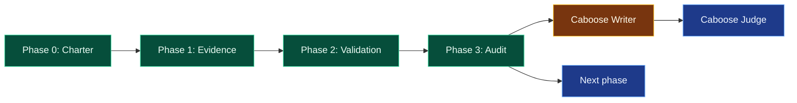

# Caboose Phase Documentation Gate

## Purpose

Use this skill when a project reaches a meaningful phase boundary and needs a durable, human-readable status checkpoint.

Caboose produces a structured report with:

- purpose;
- background;
- in-scope / out-of-scope;
- dashboard-style phase map;
- current Kanban state;
- evidence ledger;
- blockers;
- does-not-prove boundary;
- next gate;
- Judge result.

## Core Rule

Caboose is a documentation/review convention over the native Kanban system. It is not a new workflow engine.

Use normal boards, cards, parent/child dependencies, comments, blocked/review-required states, run summaries, metadata, logs, and artifact paths. Do not create a separate state machine, database, dispatcher, or truth source unless a documented upstream gap requires it.

## When To Use

Use Caboose for:

1. End-of-phase status reports.
2. Research or engineering checkpoints.
3. Work where evidence has scattered across cards, artifacts, screenshots, and chat.
4. Negative results that must remain visible.
5. Projects another agent/persona may inherit.

Skip it or make it tiny for one-off tasks.

## Required Flow

1. Inspect native Kanban state.
2. Read project artifacts directly.
3. Write the structured report.
4. Put a phase/status diagram near the top.
5. Mark statuses honestly:
   - green = complete/accepted;
   - yellow = partial/caution/writer pass;
   - red = blocked/rejected/failed;
   - blue = pending/todo;
   - gray = archived/out of scope.
6. Include a does-not-prove boundary.
7. Run or request a Caboose Judge pass before treating the report as accepted project truth.

## Required Report Sections

1. Title / identity
2. Ten-second dashboard
3. Purpose
4. Background
5. Scope
6. Current status
7. Phase map
8. Evidence ledger
9. Decisions and recommendations
10. Open questions and blockers
11. Does-not-prove boundary
12. Next gate
13. Caboose Judge result

## Mermaid Template

## Caboose Writer Contract

The Writer creates the report. It should be stateless and evidence-bound.

Inputs:

- board slug;
- workspace path;
- current Kanban list/stats/show output;
- plan, phase traceability, audit, decision memo, run reports;
- screenshots/user review comments where relevant.

Output:

- Markdown and/or HTML report;
- exact evidence paths;
- explicit unresolved issues;
- next gate and acceptance criteria;
- Judge section marked pending unless reviewed.

## Caboose Judge Contract

The Judge audits the report.

Check:

1. Required sections present.
2. Dashboard clarity within roughly ten seconds.
3. Evidence support for major claims.
4. Honest status colors.
5. Explicit in-scope/out-of-scope.
6. Does-not-prove boundary present.
7. Concrete next gate.
8. No fork from native Kanban primitives.

Outcomes:

- accepted;
- accepted-with-notes;
- changes-requested;
- blocked.

## Transfer Rule

For different domains, keep the structure and change the evidence type. CAD/FEA uses STEP files, validation JSON, solver outputs, and CAD screenshots. Biology might use papers, protocols, datasets, safety/medical boundaries, and experimental evidence gates.

The invariant is:

> Evidence first, dashboard near the top, scope boundaries explicit, judge before project truth.

## Promotion Rule

If this procedure changes materially, update this skill and the shared knowledge note rather than letting each project invent its own local variant.
